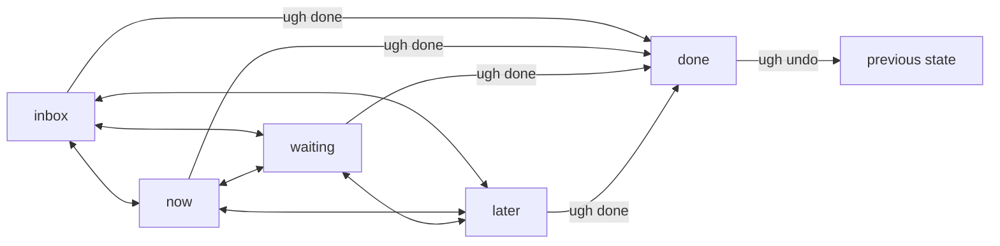
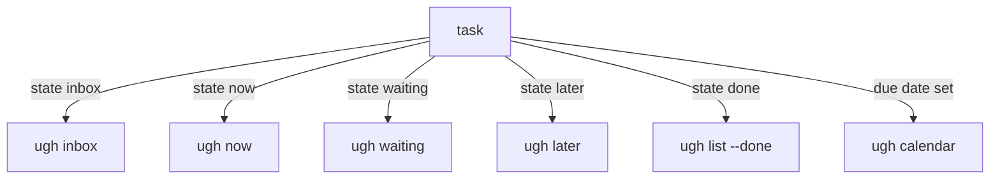

# ugh

A task CLI with SQLite storage.

## Installation

```bash
go install github.com/mholtzscher/ugh@latest
```

Or with Nix:

```bash
nix build
```

## Usage

```bash
# Add tasks
ugh add -p groceries -c errands Buy milk
ugh add --state now -p family -c phone --due 2026-01-20 Call mom


# Lists
ugh inbox
ugh now
ugh waiting
ugh later
ugh calendar

# Advanced listing
ugh list --state now
ugh list --state done
ugh list --all
ugh list --project groceries
ugh list --context errands

# List available projects/contexts
ugh projects
ugh contexts

# Complete tasks
ugh done 1 2 3

# Undo completion
ugh undo 1

# Edit a task
ugh edit 1 --state now -p work

# Show task details
ugh show 1

# Remove tasks
ugh rm 1 2
```

## Development

This CLI uses `github.com/urfave/cli/v3`. Flag names are centralized in
`internal/flags/constants.go` so commands can read values with `cmd.String()`,
`cmd.Bool()`, `cmd.Int()`, and friends.

Common tasks:

```bash
just build
just test
just lint
just fmt
```

## Output Formats

- **TTY**: Formatted table output (default)
- **JSON**: `--json` flag for machine-readable output
- **Pipe**: Tab-separated output when piped

## Configuration

ugh can be configured with a TOML file. The default location is:

- **Linux**: `~/.config/ugh/config.toml`
- **macOS**: `~/Library/Application Support/ugh/config.toml`
- **Windows**: `%AppData%\ugh\config.toml`

Use the `--config` flag to specify a custom config path.

### DB Path Resolution

The database path is resolved in this order:

1. `--db` flag (highest priority)
2. `db.path` in the config file
3. Default location: `~/.local/share/ugh/ugh.sqlite` (Linux)

Example config file:

```toml
version = 1

[db]
path = "~/.local/share/ugh/ugh.sqlite"
```

Paths support:
- Environment variable expansion (`$HOME`, `$USER`, etc.)
- Home directory expansion (`~/`)
- Relative paths (when set via config file, resolved relative to config file location)

### Sync Settings

When `db.sync_url` is set, you can enable automatic sync after writes:

```toml
[db]
sync_url = "libsql://example.turso.io"
auth_token = "..."
sync_on_write = true
```

## Global Flags

```
--config <path>  Path to config file
--db <path>      Custom database path (overrides config)
--json           Output as JSON
--no-color       Disable color output
```

## Data Model

- **State**: `inbox|now|waiting|later|done`
- **Scheduling**: `--due YYYY-MM-DD`
- **Projects/Contexts**: first-class entities linked to tasks
- **Meta**: custom `key:value` pairs

## Task Lifecycle

Tasks have a single `state`; completion is represented by `state=done`.



How the built-in lists are derived:



## License

MIT
