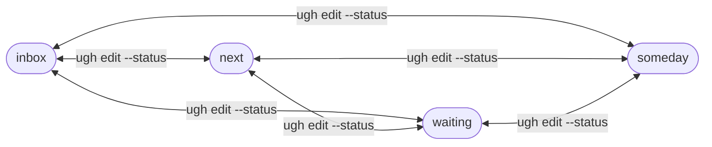

# ugh

A GTD-first task CLI with SQLite storage.

## Installation

```bash
go install github.com/mholtzscher/ugh@latest
```

Or with Nix:

```bash
nix build
```

## Usage

```bash
# Add tasks
ugh add -P groceries -c errands Buy milk
ugh add --status next -p A -P family -c phone --due 2026-01-20 Call mom

	# GTD lists
	ugh inbox
	ugh next
	ugh waiting
	ugh someday
	ugh snoozed
	ugh calendar

# Advanced listing
ugh list --status next
ugh list --all
ugh list --project groceries
ugh list --context errands
ugh list --priority A

# List available projects/contexts
ugh projects
ugh contexts

# Complete tasks
ugh done 1 2 3

# Undo completion
ugh undo 1

# Edit a task
ugh edit 1 --priority B --project work

# Show task details
ugh show 1

# Remove tasks
ugh rm 1 2

# Import/export backups
ugh export backup.jsonl --all
ugh import backup.jsonl
```

## Development

This CLI uses `github.com/urfave/cli/v3`. Flag names are centralized in
`internal/flags/constants.go` so commands can read values with `cmd.String()`,
`cmd.Bool()`, `cmd.Int()`, and friends.

Common tasks:

```bash
just build
just test
just lint
just fmt
```

## Output Formats

- **TTY**: Formatted table output (default)
- **JSON**: `--json` flag for machine-readable output
- **Pipe**: Tab-separated output when piped

## Configuration

ugh can be configured with a TOML file. The default location is:

- **Linux**: `~/.config/ugh/config.toml`
- **macOS**: `~/Library/Application Support/ugh/config.toml`
- **Windows**: `%AppData%\ugh\config.toml`

Use the `--config` flag to specify a custom config path.

### DB Path Resolution

The database path is resolved in this order:

1. `--db` flag (highest priority)
2. `db.path` in the config file
3. Default location: `~/.local/share/ugh/ugh.sqlite` (Linux)

Example config file:

```toml
version = 1

[db]
path = "~/.local/share/ugh/ugh.sqlite"
```

Paths support:
- Environment variable expansion (`$HOME`, `$USER`, etc.)
- Home directory expansion (`~/`)
- Relative paths (when set via config file, resolved relative to config file location)

### Sync Settings

When `db.sync_url` is set, you can enable automatic sync after writes:

```toml
[db]
sync_url = "libsql://example.turso.io"
auth_token = "..."
sync_on_write = true
```

## Global Flags

```
--config <path>  Path to config file
--db <path>      Custom database path (overrides config)
--json           Output as JSON
--no-color       Disable color output
```

## Data Model

- **Status**: `inbox|next|waiting|someday`
- **Scheduling**: `--due YYYY-MM-DD` and `--defer YYYY-MM-DD`
- **Projects/Contexts**: first-class entities linked to tasks
- **Meta**: custom `key:value` pairs

## Task Lifecycle

`status` is the GTD list a task belongs to; `done` is a separate on/off state.



Open vs done, and how the built-in lists are derived:

```mermaid
flowchart TB
  T[(task)]
  T -->|done=1| Done[done (hidden from GTD lists)]
  T -->|done=0| Open[open]

  Open -->|status=inbox| Inbox[ugh inbox]
  Open -->|status=waiting| Waiting[ugh waiting]
  Open -->|status=someday| Someday[ugh someday]

  Open -->|status=next AND (defer_until empty OR <= today)| Next[ugh next]
  Open -->|defer_until > today| Snoozed[ugh snoozed]
  Open -->|due_on set| Cal[ugh calendar]
```

A typical GTD "clarify" flow using ugh commands:

```mermaid
flowchart TD
  Capture[Capture\nugh add ...] --> Inbox[inbox]
  Inbox --> Actionable{Actionable?}

  Actionable -->|no| NonAction{Someday or delete?}
  NonAction -->|someday| Someday[someday\nugh edit --status someday]
  NonAction -->|delete| Delete[trash\nugh rm ID]

  Actionable -->|yes| Blocked{Waiting on someone?}
  Blocked -->|yes| Waiting[waiting\nugh edit --status waiting --waiting-for ...]
  Blocked -->|no| Later{Not before a date?}
  Later -->|yes| Defer[next (snoozed)\nugh edit --status next --defer YYYY-MM-DD]
  Later -->|no| Next[next\nugh edit --status next]

  Next --> Due[Optional: hard deadline\nugh edit --due YYYY-MM-DD]
  Defer --> Due
  Waiting --> Due

  Due --> Complete[Complete\nugh done ID]
  Complete -->|reopen| Reopen[ugh undo ID]
```

## License

MIT
