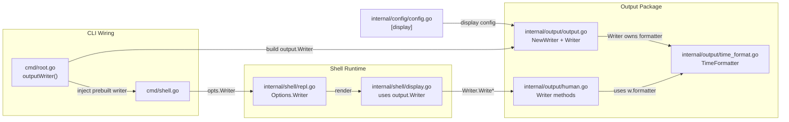
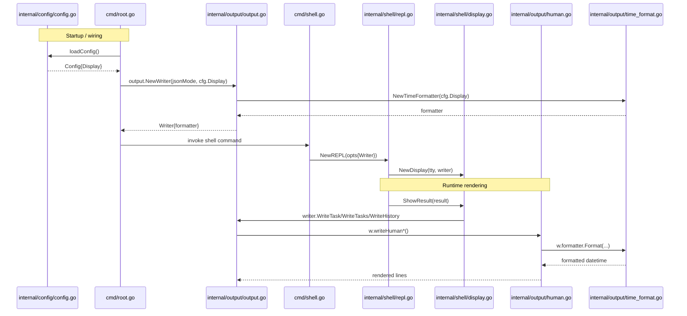

# Datetime Display Architecture

## Overview

Datetime display formatting is configured via `[display]` config and applied in the output layer.
`output.Writer` owns `TimeFormatter`, and shell code receives a prebuilt writer instead of threading config/formatter values.

## Component Relationship Diagram

## Sequence Diagram (Init + Render)

