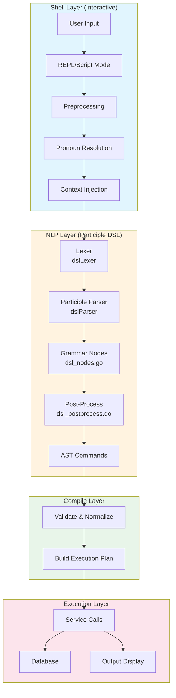
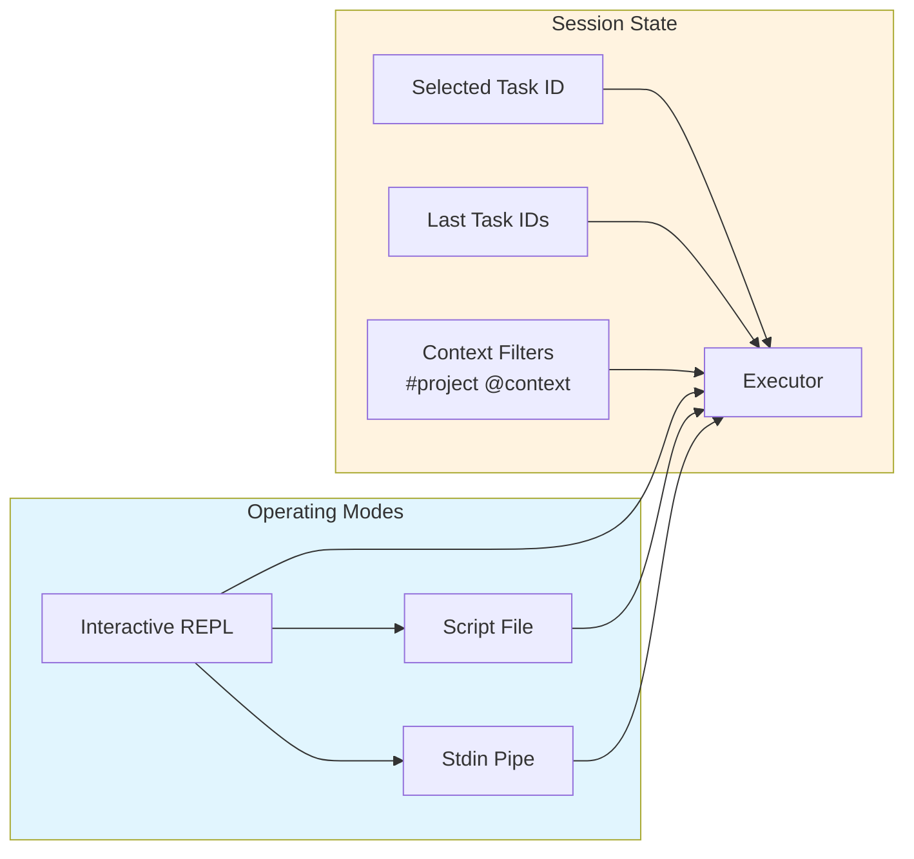
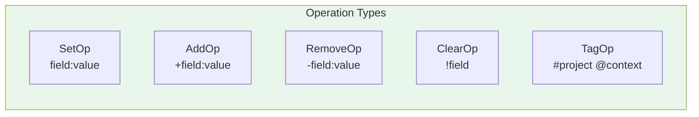
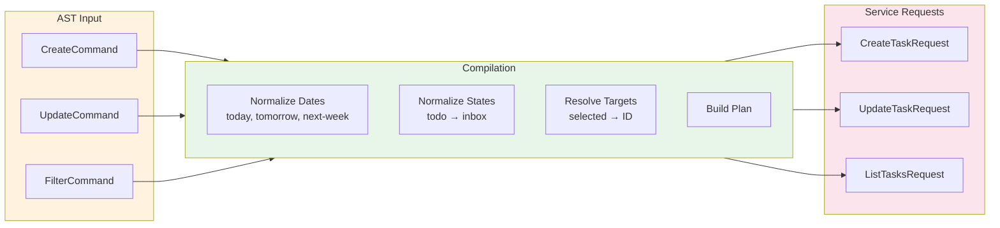
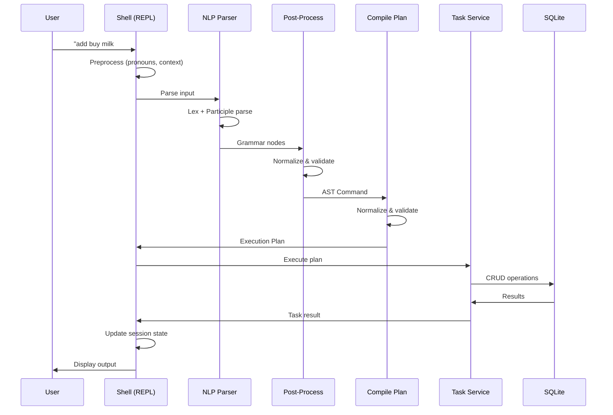
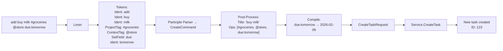
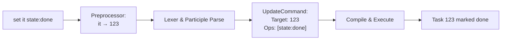
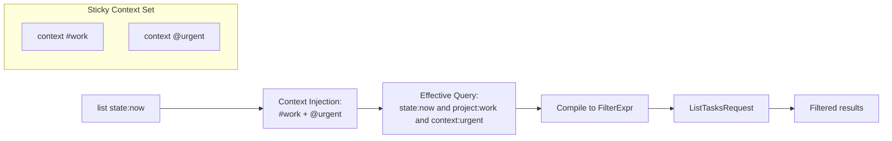

# Shell & DSL Architecture

## Overview

`ugh` provides an interactive shell for task management using a natural language-like Domain Specific Language (DSL). This document explains how the shell and DSL work together to parse and execute commands.

## Architecture Diagram



## Component Breakdown

### 1. Shell Layer (`internal/shell/`)

The shell provides the user interface and session management:



**Key Files:**
- `repl.go` - Main REPL loop (interactive/scripting modes)
- `executor.go` - Bridges shell to NLP and service layers
- `prompt.go` - Interactive prompt with readline (history, editing)
- `scripting.go` - Script file processing
- `types.go` - Session state and execution types
- `display.go` - Output formatting

**Features:**
- **Three modes**: Interactive REPL, script file execution, stdin pipe
- **Pronoun resolution**: `it`/`this` → last task, `that` → second-to-last, `selected` → selected task
- **Sticky context**: `context #project` and `context @context` apply to all subsequent commands
- **Session persistence**: Tracks recently accessed tasks and selected task

### 2. NLP Layer (`internal/nlp/`)

Uses [participle](https://github.com/alecthomas/participle) to parse natural language-like commands:

```mermaid
flowchart TD
    A[Raw Input] --> B[Lexer<br/>dslLexer]
    B --> C[Tokens]
    C --> D[Participle Parser<br/>dslParser]
    D --> E[Grammar Nodes<br/>CreateCommand etc.]
    E --> F[Post-Process<br/>dsl_postprocess.go]
    F --> G[AST Commands]

    subgraph Tokens["Token Types"]
        T1[Quoted: "buy milk"]
        T2[ProjectTag: #groceries]
        T3[ContextTag: @store]
        T4[SetField: title:]<-->T5[Ident: buy]
        T6[AndOp: &&/and]<-->T7[OrOp: ||/or]
    end

    subgraph Grammar["Grammar Nodes"]
        G1[CreateCommand]
        G2[UpdateCommand]
        G3[FilterCommand]
    end

    subgraph AST["AST Command Types"]
        A1[CreateCommand]
        A2[UpdateCommand]
        A3[FilterCommand]
    end

    C --> Tokens
    D --> Grammar
    G --> AST

    style Tokens fill:#fff3e0
    style Grammar fill:#e8f5e9
    style AST fill:#e8f5e9
```

**Key Files:**
- `lexer.go` - Participle lexer with regex rules for tokens
- `dsl_parser.go` - Participle parser configuration with Union types
- `dsl_nodes.go` - Grammar node types with struct tags and custom Parse methods
- `dsl_parse.go` - Custom Parse implementations for verbs, targets, operators
- `dsl_symbols.go` - Token type symbol mapping
- `dsl_postprocess.go` - Normalization and validation of parsed commands
- `parser.go` - Public parser interface
- `ast.go` - Final AST type definitions
- `types.go` - Parse modes and intent types

**Operations Supported:**



**Fields:**
- `title`, `notes`, `due`, `waiting`/`waiting-for`, `state`
- `projects`, `contexts`, `meta` (list fields supporting Add/Remove)

**Participle Grammar Features:**
- **Struct tags** for simple token matching: `` `parser:"@Ident"``
- **Custom Parse methods** for complex logic (synonyms, multi-token values)
- **Union types** for polymorphic nodes: `participle.Union[Command](&CreateCommand{}, ...)`
- **Custom Capture** methods for field normalization

### 3. Compile Layer (`internal/nlp/compile/`)

Transforms AST commands into service-ready execution plans:



**Key File:**
- `plan.go` - Main compilation logic (464 lines)
- `plan_test.go` - Compilation tests

**Responsibilities:**
- Date normalization: `today`, `tomorrow`, `next-week` → `YYYY-MM-DD`
- State normalization: `todo` → `inbox`
- Target resolution: `selected`, `it`, `that` → actual task IDs
- Filter compilation: Build SQL-compatible filter expressions

### 4. Execution Layer

The executor coordinates between shell state and service layer:



**Key File:**
- `internal/shell/executor.go`

## Data Flow Examples

### Example 1: Creating a Task



### Example 2: Updating with Pronouns



### Example 3: Filter with Context



## Command Syntax Reference

### Creating Tasks

```
add buy milk
add "buy milk and eggs" #groceries @store
create task due:tomorrow state:inbox +projects:personal
new "complex task" #work @urgent waiting-for:bob
```

### Updating Tasks

```
set 123 state:done
set selected title:"new title" notes:"details here"
set it +projects:work -projects:personal
edit that due:next-week
update 456 !notes          # clear notes
```

### Filtering/Querying

```
find state:now
show project:work and state:inbox
list due:tomorrow
filter @urgent
find state:now or state:waiting
show id:123
```

### Context Commands

```
context #project    # Set default project filter
context @context    # Set default context filter
context clear       # Remove all sticky filters
```

## Key Design Decisions

1. **Participle Parser**: Uses `participle` library for maintainable grammar definitions with struct tags and custom Parse methods
2. **Grammar Nodes → AST**: Participle produces grammar-specific nodes that are post-processed into the final AST
3. **Custom Parse Methods**: Used for verb synonyms (add/create/new), target references (#123, selected, it), and multi-token filter values
4. **Struct Tags**: Simple token matching where possible, custom logic only where needed
5. **Stateful Shell**: Session tracks last/selected tasks for natural pronoun usage
6. **Sticky Context**: Project/context filters persist across commands for workflow efficiency
7. **Operations Model**: Consistent `+`/`-`/`!` syntax for list field modifications
8. **Separate Compilation**: AST → Plan → Service request enables validation and normalization

## File Locations

```
internal/
├── shell/
│   ├── repl.go              # Interactive/scripting modes
│   ├── executor.go            # Shell-NLP bridge
│   ├── prompt.go              # Readline integration
│   ├── scripting.go           # File/stdin processing
│   ├── display.go             # Output formatting
│   └── types.go               # Session types
└── nlp/
    ├── lexer.go               # Participle lexer rules
    ├── dsl_parser.go          # Participle parser config
    ├── dsl_nodes.go           # Grammar node types
    ├── dsl_parse.go           # Custom Parse methods
    ├── dsl_symbols.go         # Token type symbols
    ├── dsl_postprocess.go     # Grammar → AST normalization
    ├── parser.go              # Public parser interface
    ├── parser_test.go         # Parser tests
    ├── ast.go                 # Final AST types
    ├── types.go               # Parse types
    └── compile/
        ├── plan.go            # AST → Execution plan
        └── plan_test.go       # Compilation tests
```

## Participle Grammar Details

### Lexer Rules (lexer.go)

Tokens are defined with regex patterns in priority order:
- `Quoted`: `"..."` strings
- `HashNumber`: `#123` numeric IDs
- `ProjectTag`: `#word` project tags
- `ContextTag`: `@word` context tags
- `SetField`: `field:` field setters
- `AddField`: `+field:` field additions
- `RemoveField`: `-field:` field removals
- `ClearField`: `!field` field clearing
- `Ident`: words and identifiers
- `Whitespace`: spaces (elided)

### Union Types (dsl_parser.go)

Participle unions enable polymorphic parsing:

```go
participle.Union[Command](
    &CreateCommand{},
    &UpdateCommand{},
    &FilterCommand{},
)
```

### Custom Parse Methods (dsl_parse.go, dsl_nodes.go)

Used when struct tags aren't sufficient:

```go
func (v *CreateVerb) Parse(lex *lexer.PeekingLexer) error {
    // Handle synonyms: add, create, new
    // Return participle.NextMatch if not a match
}
```

### Post-Processing (dsl_postprocess.go)

After participle parsing:
- Combine text tokens into title
- Normalize operations
- Validate required fields
- Set default targets
