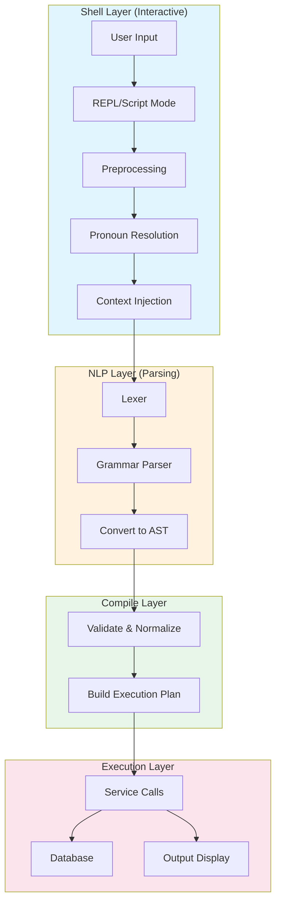
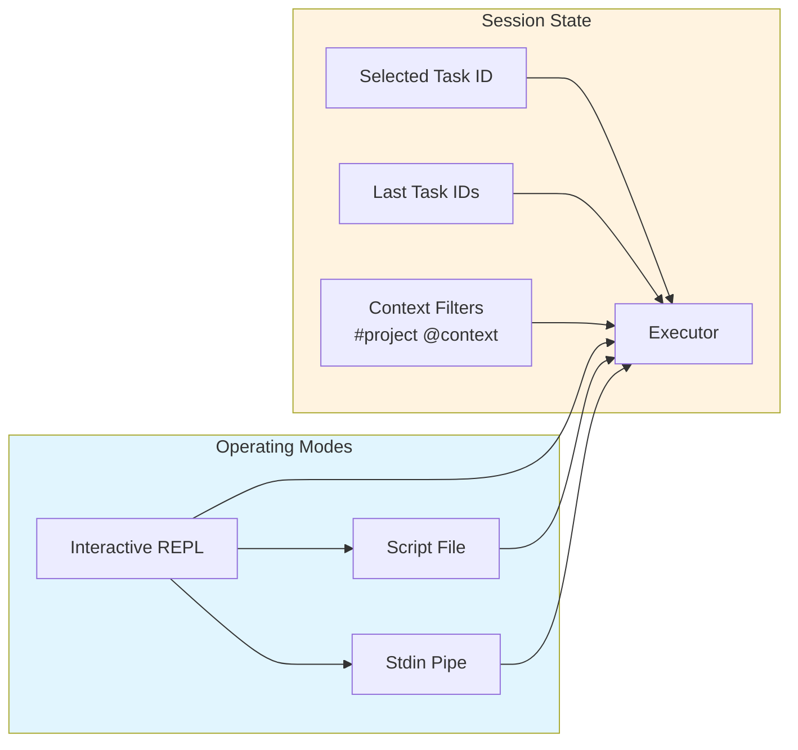
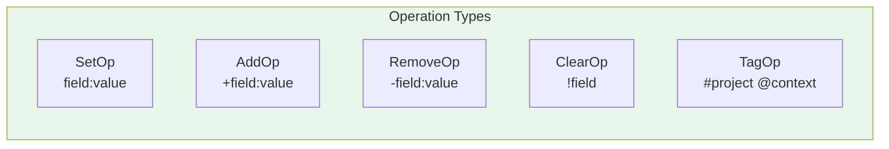
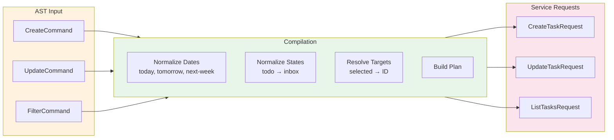
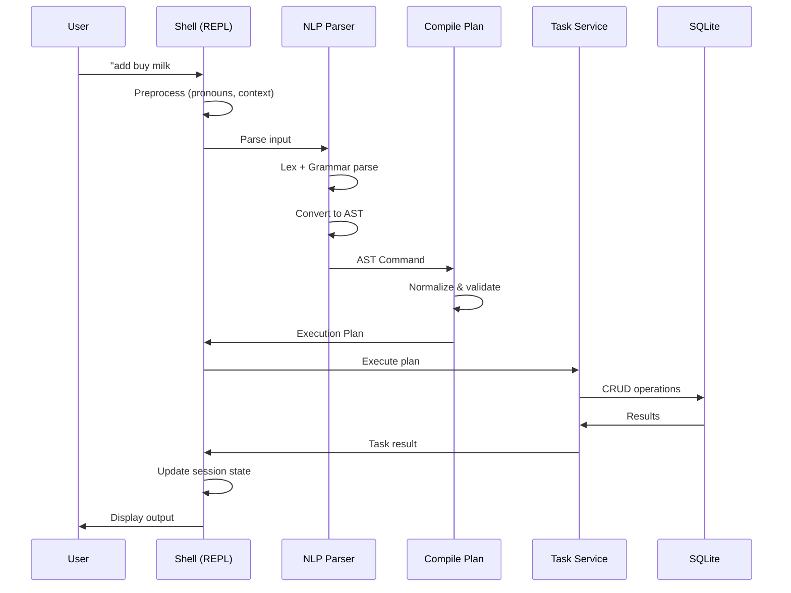
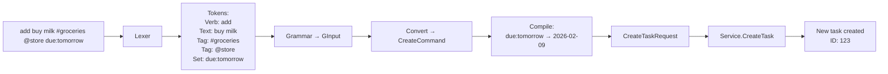
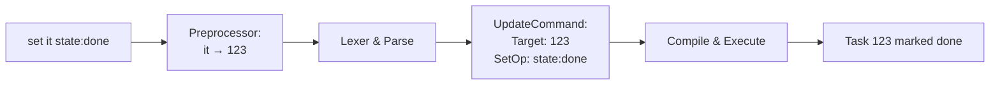
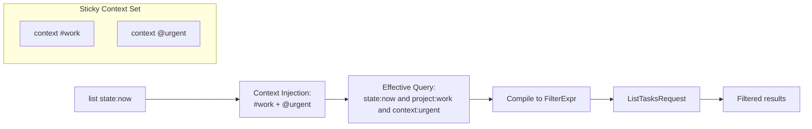

# Shell & DSL Architecture

## Overview

`ugh` provides an interactive shell for task management using a natural language-like Domain Specific Language (DSL). This document explains how the shell and DSL work together to parse and execute commands.

## Architecture Diagram



## Component Breakdown

### 1. Shell Layer (`internal/shell/`)

The shell provides the user interface and session management:



**Key Files:**
- `repl.go` - Main REPL loop (interactive/scripting modes)
- `executor.go` - Bridges shell to NLP and service layers
- `prompt.go` - Interactive prompt with readline (history, editing)
- `scripting.go` - Script file processing
- `types.go` - Session state and execution types

**Features:**
- **Three modes**: Interactive REPL, script file execution, stdin pipe
- **Pronoun resolution**: `it`/`this` → last task, `that` → second-to-last, `selected` → selected task
- **Sticky context**: `context #project` and `context @context` apply to all subsequent commands
- **Session persistence**: Tracks recently accessed tasks and selected task

### 2. NLP Layer (`internal/nlp/`)

Parses natural language-like commands into executable structures:

```mermaid
flowchart TD
    A[Raw Input] --> B[Lexer<br/>participle]
    B --> C[Tokens]
    C --> D[Grammar Parser<br/>GInput struct]
    D --> E[Convert<br/>convert.go]
    E --> F[AST Commands]

    subgraph Tokens["Token Types"]
        T1[Quoted: "buy milk"]
        T2[ProjectTag: #groceries]
        T3[ContextTag: @store]
        T4[Verb: add/create/set/find]
        T5[Op: + - !]
        T6[Logic: and/or/not]
    end

    subgraph AST["AST Command Types"]
        A1[CreateCommand]
        A2[UpdateCommand]
        A3[FilterCommand]
    end

    C --> Tokens
    F --> AST

    style Tokens fill:#fff3e0
    style AST fill:#e8f5e9
```

**Key Files:**
- `lexer.go` - Tokenizer using participle library
- `grammar.go` - Grammar structures (auto-generated)
- `convert.go` - Converts grammar tokens to typed AST (706 lines)
- `ast.go` - AST type definitions
- `types.go` - Parse modes and intent types

**Operations Supported:**



**Fields:**
- `title`, `notes`, `due`, `waiting`/`waiting-for`, `state`
- `projects`, `contexts`, `meta` (list fields supporting Add/Remove)

### 3. Compile Layer (`internal/nlp/compile/`)

Transforms AST commands into service-ready execution plans:



**Key File:**
- `plan.go` - Main compilation logic (464 lines)

**Responsibilities:**
- Date normalization: `today`, `tomorrow`, `next-week` → `YYYY-MM-DD`
- State normalization: `todo` → `inbox`
- Target resolution: `selected`, `it`, `that` → actual task IDs
- Filter compilation: Build SQL-compatible filter expressions

### 4. Execution Layer

The executor coordinates between shell state and service layer:



**Key File:**
- `internal/shell/executor.go`

## Data Flow Examples

### Example 1: Creating a Task



### Example 2: Updating with Pronouns



### Example 3: Filter with Context



## Command Syntax Reference

### Creating Tasks

```
add buy milk
add "buy milk and eggs" #groceries @store
create task due:tomorrow state:inbox +projects:personal
new "complex task" #work @urgent waiting-for:bob
```

### Updating Tasks

```
set 123 state:done
set selected title:"new title" notes:"details here"
set it +projects:work -projects:personal
edit that due:next-week
update 456 !notes          # clear notes
```

### Filtering/Querying

```
find state:now
show project:work and state:inbox
list due:tomorrow
filter @urgent
find state:now or state:waiting
show id:123
```

### Context Commands

```
context #project    # Set default project filter
context @context    # Set default context filter
context clear       # Remove all sticky filters
```

## Key Design Decisions

1. **Two-Phase Parsing**: Grammar parsing → AST conversion keeps the grammar simple while enabling rich semantics
2. **Stateful Shell**: Session tracks last/selected tasks for natural pronoun usage
3. **Sticky Context**: Project/context filters persist across commands for workflow efficiency
4. **Operations Model**: Consistent `+`/`-`/`!` syntax for list field modifications
5. **Participle Parser**: Uses `participle` library for maintainable grammar definitions
6. **Separate Compilation**: AST → Plan → Service request enables validation and normalization

## File Locations

```
internal/
├── shell/
│   ├── repl.go           # Interactive/scripting modes
│   ├── executor.go         # Shell-NLP bridge
│   ├── prompt.go           # Readline integration
│   ├── scripting.go        # File/stdin processing
│   ├── display.go          # Output formatting
│   └── types.go            # Session types
└── nlp/
    ├── lexer.go            # Tokenizer
    ├── grammar.go          # Grammar structures
    ├── parser.go           # Parser interface
    ├── convert.go          # Grammar → AST (706 lines)
    ├── ast.go              # AST types
    ├── types.go            # Parse types
    └── compile/
        └── plan.go         # AST → Execution plan (464 lines)
```
